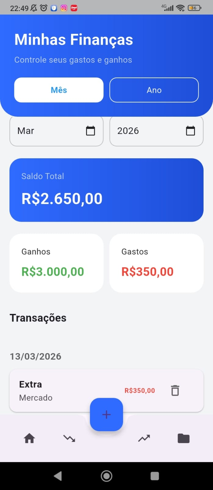
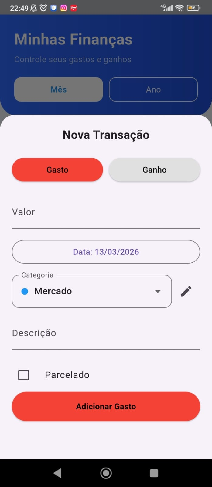
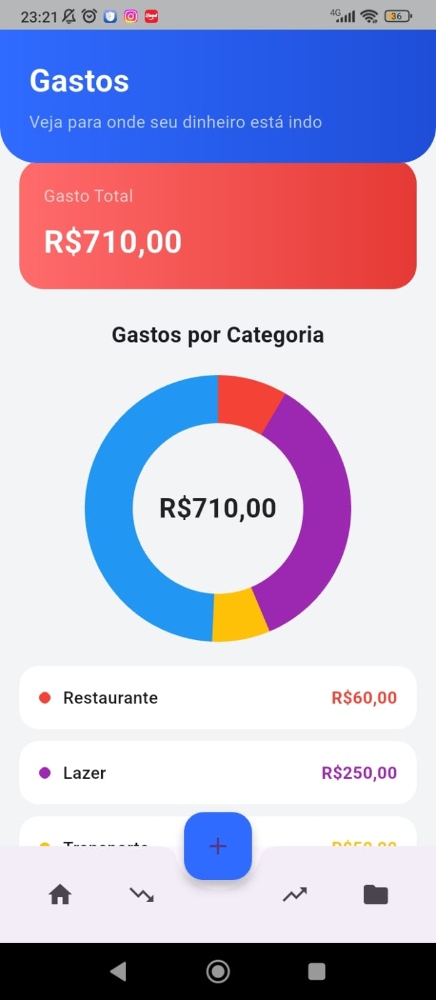
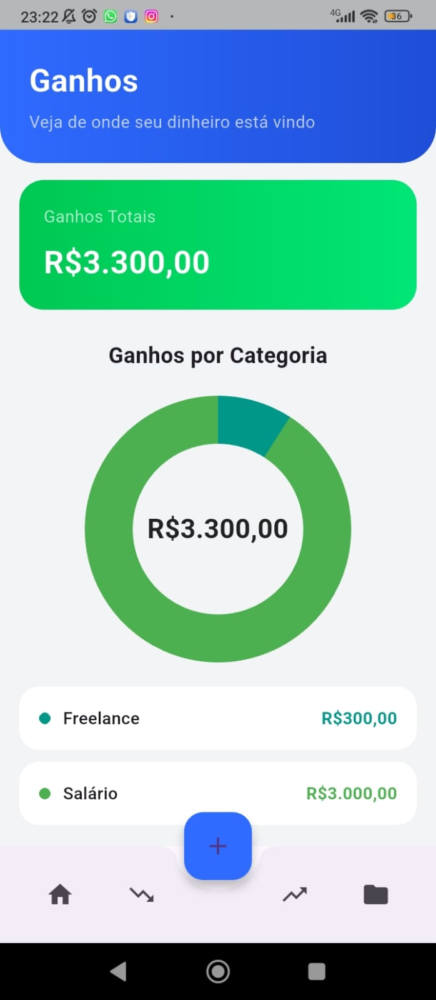
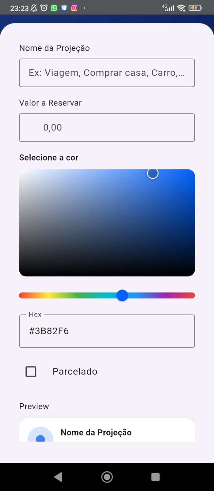
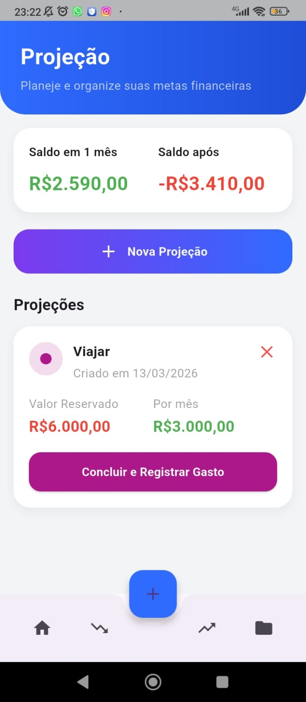

# 💰 Controle de Gastos

Aplicativo mobile desenvolvido em Flutter para gerenciamento simples de despesas pessoais.

O objetivo do aplicativo é permitir que o usuário registre, visualize e organize seus gastos de forma rápida e intuitiva.

---

## 📱 Funcionalidades

- Adicionar gastos
- Categorizar despesas
- Adicionar e controlar projeções
- Gráficos organizados
- Selecionar cores personalizadas
- Armazenamento local de dados
- Interface simples e rápida

---

## 📸 Screenshots

<table>
<tr>
<td></td>
<td></td>
  <td></td>
</tr>
<tr>
  <td></td>
  <td></td>
  <td></td>
</tr>
</table>

---

## 📦 Download

Baixe a versão mais recente do aplicativo:

👉 https://github.com/marquezlv/controle-financeiro/releases

Instale o arquivo:

app-release.apk

---

## ⚙️ Tecnologias utilizadas

- Flutter
- Dart
- SQLite / armazenamento local
- Material Design

---

## 🚀 Como executar o projeto

1. Clone o repositório https://github.com/marquezlv/controle-financeiro
2. Entre na pasta cd controle_gastos
3. Instale as dependências flutter pub get
4. Execute o projeto flutter run

## 📂 Estrutura do projeto

lib/
├── core/database
├── models
├── navigation
├── screens
├── utils
├── widgets
└── main.dart

---

## 🧠 Objetivo do projeto

Este projeto foi desenvolvido como prática de desenvolvimento mobile utilizando Flutter.

---

## 📄 Licença

Este projeto está sob licença MIT.
